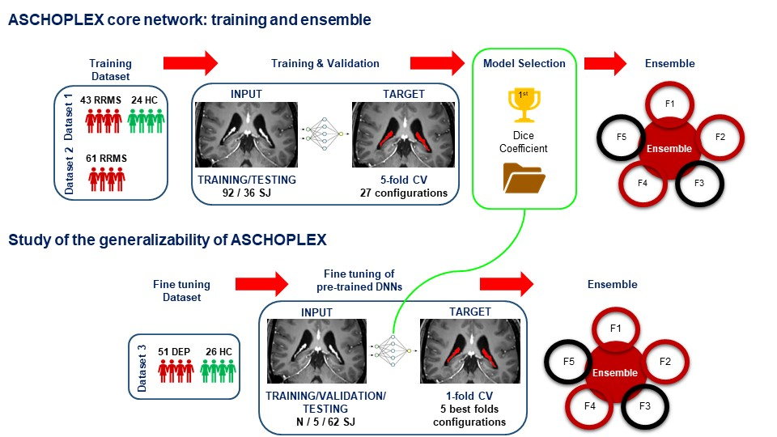

# ASCHOPLEX: Automatic Segmentation of Choroid Plexus toolbox
What is **A**utomatic **S**egmentation of **CHO**roid **P**lexus ?

ASCHOPLEX is a Deep Learning based toolbox for the Automatic Segmentation of Choroid Plexus starting from brain MRI. 

ASCHOPLEX was trained in a 5-folds cross-validation fashion on 128 subjects derived from two different dataset with following characteristics:

| Dataset | #Subjects | Scanner | Sequence |
| --- | --- | --- | --- |
| #1 | 67 subjects (24 controls, 43 Relapsing-Remitting Multiple Sclerosis patients)| Philips Achieva TX with 8-channels head coil (Software version R3.2.3.2) | 3D T1-w MPRAGE, resolution 1x1x1 mm, SENSE acceleration factor 2.5, TE/TR 3.7/8.4 ms, FA: 9°|
| #2 | 61 subjects Relapsing-Remitting Multiple Sclerosis patients | Philips Elition S with 32-channels head coil (Software version R5.7.2.1) | 3D T1-w MPRAGE, resolution 1x1x1 mm, SENSE acceleration factor 4, TE/TR 3.7/8.4 ms, FA: 8° |

ASCHOPLEX returns the ensemble by major voting segmentation of five selected models (best one for each fold) predictions, improving robustness and reuserbility of the output segmentation.

Two main modality has been tested:
1. Direct Inference: ASCHOPLEX has been directly inferred on the unseen dataset. The final prediction is the ensemble by major voting of the predictions obtained with the best five-folds models trained on Dataset 1 and Dataset 2.
2. Finetuning: ASCHOPLEX has been finetuned on the unseed dataset varying the number of subjects (1-10) in the training set. Only the previously selected five models has been finetuned using 1-fold cross-validation. The final segmentation derived from the ensemble by major voting of predictions derived by the five finetuned models.

Both ASCHOPLEX modalities were tested on an unseen dataset composed by 77 subjects (26 controls, 51 depressed) acquired on a GE SIGNA PET/MRI scanner with a 3D T1-w Fast SPGR sequence, resolution 1x1x1 mm, TE/TR 2.99/6.96 ms, FA 12°. Please, see **References** section for details.

Due to the data-driven nature of ASCHOPLEX, results confirmed the addiction of a finetuning step allows reaching the same performance of the training phase on an unseen dataset. The selected number of subjects in the training set of the finetuning step is 5 (and 5 for the validation).

## Prerequisites
- NVIDIA GPU with minimum 8 GB RAM
- PyTorch version >= 1.13
- CUDA version >= 12.0
- x86_64 or ARM CPU
- MacOS, or Windows 10/11 [coming soon]
- Docker >= 24.0.7
- NVIDIA container toolkit [https://docs.nvidia.com/datacenter/cloud-native/container-toolkit/latest/install-guide.html]
- Data structure: see section **Input Data: Structure and Characteristics**

### Input Data: Structure and Characteristics

Data must be in Nifti format (.nii, .nii.gz).
Data must be untouched: no preprocessing (e.g. brain extraction, intensity correction) is needed.

Input data must be structured as follows:

    DATASET
        |-image_Tr
            |-MRI_IDsj_image.nii.gz
            |- ....
        |-image_Ts
            |-MRI_IDsj_image.nii.gz
            |- ....
        |-label_Tr
            |-MRI_IDsj_seg.nii.gz
            |- ....

where IDsj must be a unique identifier for the subjects, image_Tr is the folder with 10 subjects images (*image.nii*) with relative manual segmentations (*seg.nii*) saved in label_Tr (necessary only if --finetuning yes), image_Ts is the folder with testing subjects (*image.nii*).
Optimal number of labelled subjects needed for the finetuning step is 10 (5 training, 5  validation). If you have few or more subjects in image_Tr and label_Tr, the toolbox automatically divides the total number of subjects in half. If the total number is odd (i.e. 9), more subjects will be used in the training step (i.e 5 training, 4 validation).

## What to do before launching ASCHOPLEX

You can choose two ways to run ASCHOPLEX:

1) Docker
2) Python files

### 1) How to run ASCHOPLEX with Docker

Pull the docker image (Linux):
    
    sudo docker pull marcocastellaro/aschoplex
    
Then you can run the image and access to ASCHOPLEX just passing extra arguments, like in this example:    
    
    sudo docker run  --ipc=host --ulimit memlock=-1 --gpus device=0 -v {LOCAL_PATH}:{VIRTUAL_PATH} marcocastellaro/aschoplex 
            --dataroot={VIRTUAL_PATH_WITH_DATAROOT} 
            --work_dir={VIRTUAL_PATH_FOR_WORKDIR} 
            --finetune yes 
            --prediction yes

The docker image is based on Nvidia PyTorch Runtime (version 24.01-py3) more info can be found here [https://catalog.ngc.nvidia.com/orgs/nvidia/containers/pytorch/tags].

Please refer to the Nvidia manual on how to correctly configure the use of your GPU card. In the example we used a single gpu card with id 0, however it is possible to use multiple GPUs.

Please see section **ASCHOPLEX tool steps** for details on how to deal with extra parameters to provide the correct paths and options to ASCHOPLEX.

Pull the docker image (Windows/macOS):
Coming soon...

### 2) How to run ASCHOPLEX with Python files

To run ASCHOPLEX without docker file, you have to create a conda environment:

    cd {path}
    conda create -n aschoplex

Download git repository:
    
    cd {your_git_download_path}
    git clone https://gitlab.dei.unipd.it/fair/aschoplex.git    
    
Download the env_aschoplex.yml configuration file and update the environment:

    conda env update --name aschoplex --file {your_git_download_path}/env_aschoplex.yml
    git clone https://github.com/csudre/MetricsReloaded.git
    cd MetricsReloaded/
    python -m pip install .
    cd {path}
    rm -rf MetricsReloaded

Activate the environment:

    conda activate aschoplex
    
Set your working path as an environment variable (macOS/Linux):

    export ASCHOPLEXDIR={your_git_download_path}/aschoplex
    
Set your working path as an environment variable (Windows):

    set ASCHOPLEXDIR=c:\{your_git_download_path}\aschoplex;

Please see section **ASCHOPLEX tool steps** for details on how to deal with extra parameters to provide the correct paths and options to ASCHOPLEX.

## ASCHOPLEX tool steps

ASCHOPLEX has been structured as a Python tool with selected mandatory and optional input parsers.

    python $ASCHOPLEXDIR/launching_tool.py --dataroot {path} --work_dir {path} --finetune {flag} --prediction {flag} --{Optional Parser}

Mandatory Inputs:
    
    --dataroot: data directory
    --work_dir: working directory
    --finetune: yes/no, finetuning flag
    --prediction: yes/no/ft, prediction flag
    
Optional Inputs:
    
    --description: data description (will be inserted in the JSON file)
    --output_pred_dir: Working directory where to save predictions. If not specified, default folder name and location (work_dir) will be used
    --finetune_dir: Working directory where to save finetuned models. If not specified, default folder name and location (work_dir) will be used

First mandatory step of ASCHOPLEX is writing JSON file. The JSON file will be saved in {work_dir}/JSON_file folder.
Based on --finetune and --prediction flags, different files will be created (see the possible combinations):

        - {work_dir}/JSON_file/dataset_prediction.json for Direct Inference
        - {work_dir}/JSON_file/dataset_finetuning.json for Only Finetuning, Finetuning & Prediction, Prediction after Finetuning
   
ASCHOPLEX pipeline automatically run the following steps basing on --finetune and --prediction flags.

You can selected one of these combinations:

1) Direct Inference: not recommended instead of data match that used for the training of ASCHOPLEX (Dataset 1, Dataset 2). The output segmentation is the ensemble by major voting of the predictions obtained by the best five selected models (trained on Dataset 1 and Dataset 2). It returns the predictions and the folder path where predictions have been saved.
    
        python $ASCHOPLEXDIR/launching_tool.py --dataroot {path} --work_dir {path} --finetune no --prediction yes
            
2) Finetuning & Prediction: recommended modality. After the finetuning of ASCHOPLEX on 10 manually segmented subjects (5 for training and 5 for validation), the ensemble by major voting is performed using the five finetuned models. It returns the models and the folder path where models have been saved, and the predictions and the folder path where predictions have been saved.

        python $ASCHOPLEXDIR/launching_tool.py --dataroot {path} --work_dir {path} --finetune yes --prediction yes
            
3) Only Finetuning: recommended modality. The finetuning of ASCHOPLEX on 10 manually segmented subjects (5 for training and 5 for validation) has been performed without obtaining the ensemble prediction. It returns the models and the folder path where models have been saved.
            
        python $ASCHOPLEXDIR/launching_tool.py --dataroot {path} --work_dir {path} --finetune yes --prediction no
            
4) Prediction after Finetuning: recommended modality for prediction when you new data, with same characteristics of the previous ones, are available. The output segmentation is the ensemble by major voting performed using the predictions derived by the five previously finetuned models. It returns the predictions and the folder path where predictions have been saved.

        python $ASCHOPLEXDIR/launching_tool.py --dataroot {path} --work_dir {path} --finetune no --prediction ft

## References

### Preprint
Valentina Visani, Mattia Veronese, Francesca B Pizzini, et al. ASCHOPLEX: a generalizable approach for the automatic segmentation of choroid plexus. TechRxiv. February 12, 2024. DOI: 10.36227/techrxiv.170775526.68157658/v1

### Journal paper
Submitted
Coming soon...
