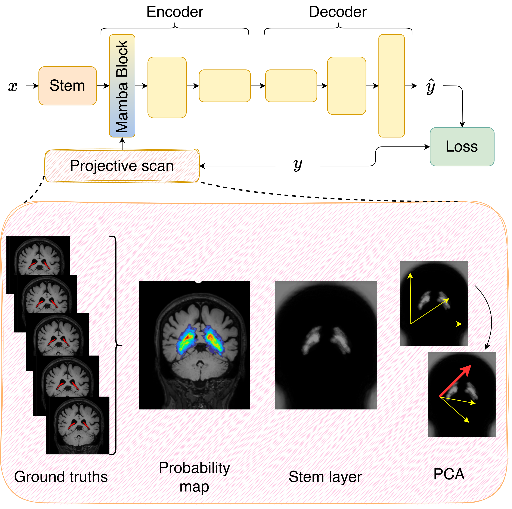
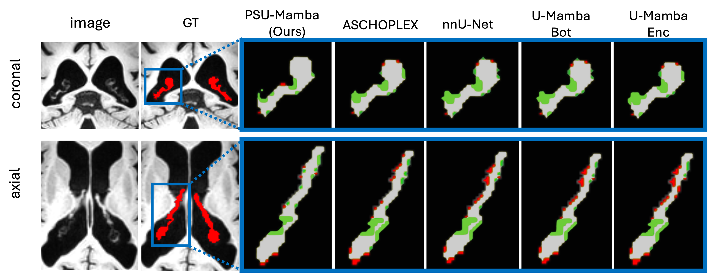

# Choroid Plexus Segmentation in MRI Using the Novel T1×FLAIR Modality and PSU-Mamba: a Projective Scan U-Mamba Approach

The Choroid Plexus (CP) is increasingly recognized as a potential biomarker for neurodegenerative diseases (NDDs) such as Alzheimer’s Disease and its precursor pathologies. However, segmentation remains challenging, especially when Contrast-Enhanced T1-weighted (CE-T1w) imaging—typically used in Multiple Sclerosis (MS)—is unavailable due to its invasiveness and limited clinical use in NDDs.
To address these challenges, we introduce three key contributions. First, we propose and validate *T1×FLAIR*, a novel, non-invasive modality created by gamma-corrected voxelwise multiplication of coregistered T1w and FLAIR images. This modality is clinically feasible and preserves the resolution of standard imaging while improving CP visibility. Second, we introduce *PSU-Mamba* (Projective Scan U-Mamba), a segmentation model that incorporates anatomical priors of the structure to be segmented into an optimal flattening strategy for Mamba layers. This design enhances segmentation accuracy while maintaining linear complexity and demonstrates faster convergence even with fewer training epochs. Third, we release *ChP-MRI*, a high-quality 3D MRI dataset of 168 patients with NDDs or MS,  including T1w, FLAIR, and T1×FLAIR images with corresponding expert-annotated CP segmentations. This dataset—clinically validated, quality-controlled, and multi-pathology—sets a new benchmark for CP segmentation research. Experimental results on ChP-MRI confirm the effectiveness of the proposed approach, showing that T1×FLAIR outperforms T1-weighted imaging as an alternative to CE-T1w and that PSU-Mamba is  systematically more robust than state-of-the-art segmentation methods. 

Note: Dataset can be requested contacting anonymous@anoym.com.

Our main contributions can be summarized as follows:

- We propose and validate a novel modality, namely **T1×FLAIR**, as the new gold standard for CP segmentation as an alternative to CE-T1w imaging.
- We introduce the **Projective Scan U-Mamba (PSU-Mamba)** model, which incorporates the geometric characteristics of the choroid plexus by incorporating a positional projectove scan strategy, to enhance U-Mamba-based segmentation.
- We release **ChP-MRI**, a high-quality 3D MRI dataset comprising 168 patients with neurodegenerative diseases or multiple sclerosis, each with corresponding T1-weighted, FLAIR, and T1×FLAIR modalities, along with ground truth (GT) segmentations.

### PSU-Mamba:
The network follows a U-Net-style encoder-decoder structure. It begins with a ResNet-based stem layer, followed by a Mamba block comprising a convolutional layer and a Mamba layer with a projective scan to determine the flattening of the input. The remaining *N-1* encoder layers and all $N$ decoder layers are implemented as convolutional layers. 

<p align="center">
  
</p>

To compute the positional projective scan, we start from the ground truths, generate a probability map ◊and passed through the stem layer. PCA is then applied. Subsequently, all inputs processed through the same stem layer are projected on the principal direction identified by the PCA.

### Conclusion:
 PSU-Mamba as a geometry-aware 3D segmentation framework that integrates a Mamba block at the input layer to enable anatomically guided scan paths via a projective strategy. Applied to a new high-quality choroid plexus dataset with T1×FLAIR imaging, it improves segmentation in low-contrast regions, accelerates convergence, and generalizes to other complex 3D structures—offering a fast, contrast-free alternative for clinical use.
<p align="center">
  
</p>


## Set Up
Our work is built on nnUNetv2.

nnU-Net relies on environment variables to know where raw data, preprocessed data and trained model weights are stored.
To use the full functionality of nnU-Net, the following three environment variables must be set:

1) `nnUNet_raw`: This is where you place the raw datasets. This folder will have one subfolder for each dataset names
   DatasetXXX_YYY where XXX is a 3-digit identifier (such as 001, 002, 043, 999, ...) and YYY is the (unique)
   dataset name. The datasets must be in nnU-Net format, see [here](dataset_format.md).

   Example tree structure:

   ```
   nnUNet_raw/Dataset001_NAME1
   ├── dataset.json
   ├── imagesTr
   │   ├── ...
   ├── imagesTs
   │   ├── ...
   └── labelsTr
       ├── ...
   nnUNet_raw/Dataset002_NAME2
   ├── dataset.json
   ├── imagesTr
   │   ├── ...
   ├── imagesTs
   │   ├── ...
   └── labelsTr
       ├── ...
   ```
2) `nnUNet_preprocessed`: This is the folder where the preprocessed data will be saved. The data will also be read from
   this folder during training. It is important that this folder is located on a drive with low access latency and high
   throughput (such as a nvme SSD (PCIe gen 3 is sufficient)).
3) `nnUNet_results`: This specifies where nnU-Net will save the model weights. If pretrained models are downloaded, this
   is where it will save them.

# Linux & MacOS

## Permanent setting of environment variables

Locate the `.bashrc` file in your home folder and add the following lines to the bottom:

```bash
export nnUNet_raw="/data/Umamba_data/nnUNet_raw"
export nnUNet_preprocessed="/data/Umamba_data/nnUNet_preprocessed"
export nnUNet_results="/data/Umamba_data/nnUNet_results"
```

 Furthermore, export the U-Mamba trainers to make them accessible by imports

```bash
 export PYTHONPATH=$PYTHONPATH:/U-Mamba/umamba/nnunetv2
```

## Usage

### Plan and Preprocess

```
nnUNetv2_plan_and_preprocess -d 433 -c 3d_fullres -overwrite_plans_name nnUNetPlans_conv --verify_dataset_integrity
```

### Training of the folds

```
nnUNetv2_train 433 3d_fullres 0 -tr nnUNetTrainerMambaFirstStem_PCA_PSU_Mamba -p nnUNetPlans_First_general_64 --npz --c
nnUNetv2_train 433 3d_fullres 1 -tr nnUNetTrainerMambaFirstStem_PCA_PSU_Mamba -p nnUNetPlans_First_general_64 --npz
nnUNetv2_train 433 3d_fullres 2 -tr nnUNetTrainerMambaFirstStem_PCA_PSU_Mamba -p nnUNetPlans_First_general_64 --npz
nnUNetv2_train 433 3d_fullres 3 -tr nnUNetTrainerMambaFirstStem_PCA_PSU_Mamba -p nnUNetPlans_First_general_64 --npz


nnUNetv2_train 299 3d_fullres 0 -tr nnUNetTrainerMambaFirstStem_PCA_PSU_Mamba -p nnUNetPlans_First_general_128 --npz --c # 
nnUNetv2_train 299 3d_fullres 1 -tr nnUNetTrainerMambaFirstStem_PCA_PSU_Mamba -p nnUNetPlans_First_general_128 --npz --c # 
nnUNetv2_train 299 3d_fullres 2 -tr nnUNetTrainerMambaFirstStem_PCA_PSU_Mamba -p nnUNetPlans_First_general_128 --npz --c # 
nnUNetv2_train 299 3d_fullres 3 -tr nnUNetTrainerMambaFirstStem_PCA_PSU_Mamba -p nnUNetPlans_First_general_128 --npz --c # 

```

### Finding best configuration
```
nnUNetv2_find_best_configuration 433 -c 3d_fullres -tr nnUNetTrainerMambaFirstStem_PCA_PSU_Mamba -p nnUNetPlans_First_general_64 -f 0 1 2 3
```

### Postprocessing of prediction

```
OUTPUT_FOLDER = "SET_YOUR_PATH"
OUTPUT_FOLDER_PP = "SET_YOUR_PATH_PP"


```

